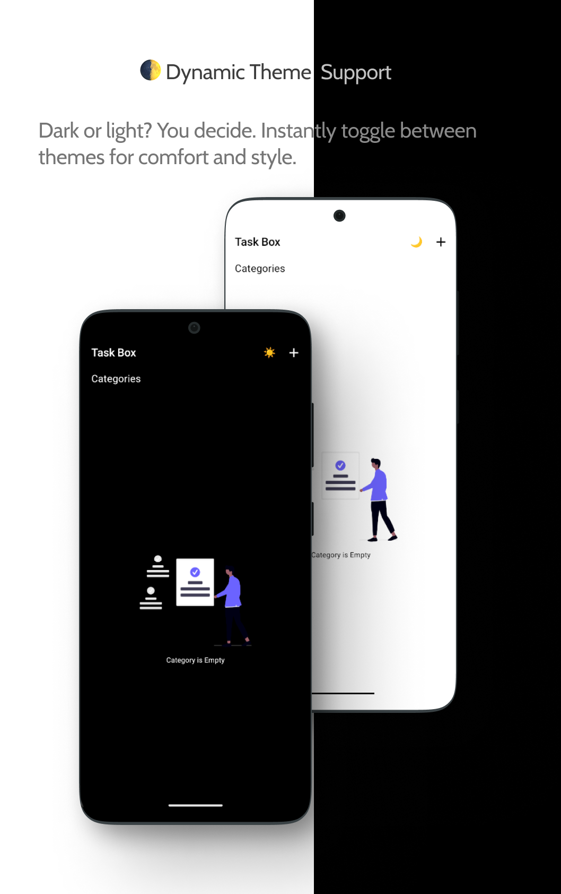
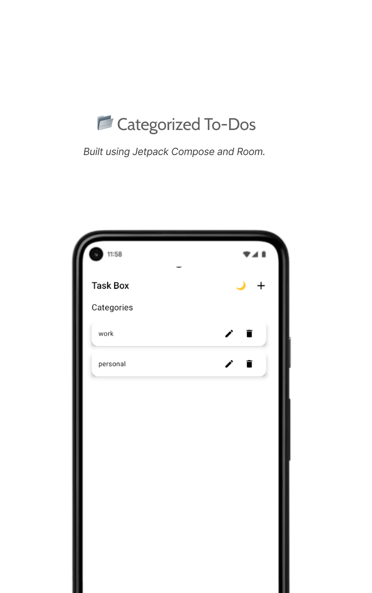
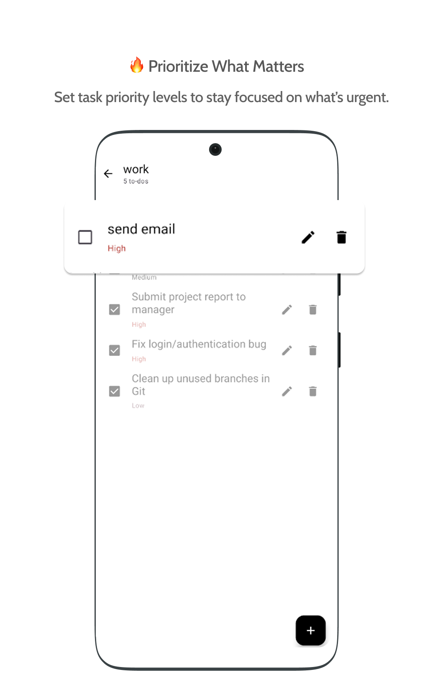

# TaskBox

TaskBox is a simple and intuitive task management Android app built with Kotlin. It helps you organize your daily tasks, manage subtasks, and boost your productivity with a clean, user-friendly interface.

---

## Features

- Create, edit, and delete tasks
- Add and manage tasks
- Categorize and prioritize tasks
- Mark tasks as completed
- Minimalistic and distraction-free UI

---

## Demo






---

## Installation

1. Clone the repository:
   ```bash
   git clone https://github.com/your-username/TaskBox.git
2. Open the project in Android Studio

3. Sync Gradle and build the project

4. Run the app on an emulator or device

## Usage

- Tap + to add a new category

- Tap a category to add task 

- edit or delete tasks 

- Use checkboxes to mark tasks done

